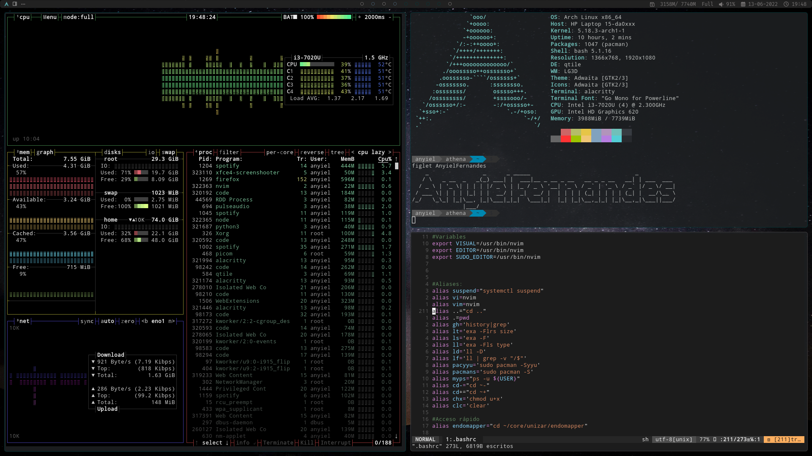

# Qtile

# Install guide

## Keyboard config (spanish)
    loadkeys es 

## Check UEFI boot and internet connectivity
    ls /sys/firmware/efi/efivars
    ip addr show
    ping www.google.es

## Update system clock 
    timedatectl set-ntp true
    timedatectl status
    pacman -Syyy

## Disk partitioning
### Check disk name 
    fdisk -l

### New partition table (not if dualboot)
    parted /dev/sda mklabel gpt

### Partitioning Example
    parted /dev/sda
    print free
    mkpart primary fat32 0% 512MB
    set 1 esp on 
    mkpart primary ext4 512MB 100%
    set 2 lvm on 

### Format UEFI partition (if there is no one)
    mkfs.fat -F32 /dev/sda1

## LVM

### Create physical volume
    pvcreate --dataalignment 1m /dev/sda2
    
### Create volume group
    vgcreate volgroup0 /dev/sda2

### Create logical volumes (Example)
    lvcreate -L 30GB volgrpup0 -n lv_root
    lvcreate -l 100%FREE volgropup0 -n lv_home

### Check results before activation
    lvs

### Activate logical volumes
    modproble dm_mod
    vgscan 
    vgchange -ay

### Formatting and mounting
    mkfs.ext4 /dev/volgroup0/lv_root
    mount /dev/volgroup0/lv_root /mnt

    mkfs.ext4 /dev/volgroup0/lv_home
    mkdir /mnt/home
    mount /dev/volgroup0/lv_home /mnt/home

### Check mounting points 
    cat /proc/mounts

### Generate fstab file
    genfstab -U -p /mnt >> /mnt/etc/fstab
    mkdir /mnt/etc
    cat /mnt/etc/fstab

## Arch install
    pacstrap -i /mnt base linux linux-firmware
    arch-chroot /mnt
    pacman -S linux-headers linux-lts linux-lts-headers
    pacman -S neovim base-devel
    pacman -S networkmanager wpa_supplicant wireless_tools netctl
    pacamn -S dialog 

## Network 
    systemctl enable NetworkManeger

## Enable LVM
    pacman -S lvm2

### Edit /etc/mkinitcpio.conf: 
    HOOKS=(base udev autodetect modconf block lvm2 filesystems keyboard fsck)

### FInally, enable on installed kernels
    mkinitcpio -p linux
    mkinitcpio -p linux-lts

## Locale
### Uncomment wanted line in /etc/locale.gen, then:
    nvim 
    locale-gen
    echo "LANG=es_ES.UTF-8" > /etc/locale.conf
    echo "KEYMAP=es" > /etc/vconsole.conf

## Time Zone
    ln -sf /usr/share/zoneinfo/Europe/Madrid /etc/localtime
    hwclock --systohc

## Main user
    passwd
    useradd -m -g users -G wheel,audio,video,optical,storage USERNAME
    passwd USERNAME

## Sudo
    pacman -S sudo 
    EDITOR=nvim visudo

Uncomment line: 

    wheel ALL = (ALL) ALL

## Grub
    pacman -S grub efibootmgr dosfstools os-prober mtools 
    mkdir /boot/EFI
    mount /dev/sda1 /boot/EFI
    cat /proc/mounts
    grub-install --target=x86_64-efi --bootloader-id=GRUB --recheck

### Check if locale dir exists in /boot/grub
    ls -l /boot/grub

### Language
    cp /usr/share/locale/en\@quot/LC_MESSAGES/grub.mo /boot/grub/locale/en.mo

### Enable OS PROBER (only for dual boot)
    nvim /etc/default/grub
        -> GRUB_DISABLE_OS_PROBER=false

### Generate grub config
    grub-mkconfig -o /boot/grub/grub.cfg

### Reboot
    exit 
    umount -a 
    reboot

# Post-install

## SWAP file
    dd if=/dev/zero of=/swapfile bs=1M count=1024 status=progress
    chmod 600 /swapfile
    mkswap /swapfile
    cp /etc/fstab /etc/fstab.bak
    echo '/swapfile none swap sw 0 0' |tee -a /etc/fstab
    free -m 
    mount -a
    swapon -a 

## Time Zone (Spain)
    timedatectl list-timezones
    timedatectl set-timezone Europe/Madrid
    systemctl enable systemd-timesyncd

### To avoid some issues with widows dualboot
    timedatectl set-local-rtc 1

## Hostname
    hostnamectl set-hostname HOSTNAME

## /etc/hosts
    127.0.0.1       localhost
    ::1             localhost
    127.0.1.1       HOSTNAME

## Install microcode (intel)
    pacman -S intel-ucode

## Desktop
    pacman -S xorg xorg-server picom

### Video drivers

#### Intel: 
    pacman -S mesa

#### Virtualbox: 
    pacman -S virtualbox-guest-utils xf86-video-vmware & systemctl enable vboxservice

### Session Manager (lightDM)
    pacman -S lightdm lightdm-gtk-greeter 
    systemctl enable lightdm

#### LightDM Theme litarvan
    pacman -S lightdm-webkit-theme-litarvan
    vi /etc/lightdm/lightdm.conf
        -> greeter-session=lightdm-webkit2-greeter
    vi /etc/lightdm/lightdm-webkit2-greeter.conf
        -> webkit_theme = litarvan
    

### Qtile
    sudo pacman -S python python-pip qtile 

### Keymap for X11
    localectl set-x11-keymap es

### AUR: Yay
    pacman -S git 
    cd /opt 
    sudo git clone https://aur.archlinux.org/yay.git
    sudo chown -R anyiel:users ./yay
    cd yay
    makepkg -si

### Audio 
    pacman -S pulseaudio pulseaudio-alsa

### Basic Software (In my case)
    pacman -S firefox alacritty nautilus xfce4-screenshooter nomacs okular bpytop redshift code discord
    yay -S spotify

## Some system configurations and extra tools
	sudo pacman -S neofetch exa rofi code brightnessctl vi otf-font-awesome alsa-firmware alsa-utils libinput feh bc nodejs npm pavucontrol 

### Picom fork for some extra utilities
    yay -S picom-jonaburg-git
    nvim /etc/xdg/picom.conf 

### Sound config (laptop)
#### If sound is not working
    amixer sset Master unmute
    amixer sset Speaker unmute
    amixer sset Headphone unmute
#### If still not working
    alsamixer
    yay -S volctl
#### Some useful configurations:
Auto-switch when new device is plugged:

    pactl list short modules 
        -> module-switch-on-connect
           module-switch-on-port-available
    pactl load-module module-switch-on-connect
    pactl load-module module-switch-on-port-available
#### If Everything works, edit /etc/pulse/default.pa to persist changes

### Mouse (laptop)
#### Edit /etc/X11/xorg.conf.d/30-touchpad.conf:
    Section "InputClass"
        Identifier "devname"
        Driver "libinput"
        MatchIsTouchpad "on"
        Option "Tapping" "on" 
        Option "NaturalScrolling" "true"
    EndSection

### Dual screen support for Qtile
#### Edit /etc/lightdm.conf and add .config/qtile/autostart.sh script on LightDM boot

### Poweshell
    sudo pacman -S powerline-fonts
    https://github.com/powerline/fonts

### Bluetoth
    sudo pacman -S bluez bluez-utils blueman pulseaudio-bluetooth
    modprobe btusb
    sudo systemctl start bluetooth.service
    sudo systemctl enable bluetooth.service
    sudo systemctl status bluetooth.service

#### Edit /etc/bluetooth/main.conf to enable bluetooth on boot, then:
    sudo systemctl start bluetooth 
    sudo systemctl enable bluetooth 

#### Conect to device from command line
    bluetoothctl
    select <DEVICE MAC>
    power on
    #Editar /etc/bluetooth/main.conf para habilitar en el arranque

### Wifi
    sudo pacman -S network-manager-applet nm-applet

### Desktop notifications
    sudo pacman -S dunst libnotifynotification-daemon
    sudoedit /usr/share/dbus-1/services/org-freedesktop.Notifications.service
    -> 
            [D-BUS Service]
            Name=org.freedesktop.Notifications
            Exec=/usr/lib/notification-daemon-1.0/notification-daemon

### GTK settings
    nvim .config/gtk-3.0/settings.ini
    -> 
        [Settings]
        gtk-application-prefer-dark-theme=1

### Cursor config
    yay -S xcursor-breeze        
    edit /usr/share/icons/default/index.theme
    edit ~/.config/gtk-3.0/settings.ini

### Power management (laptop)
    editar /etc/systemd/logind.conf
    -> 
        HandleLidSwitch=suspend
        HandleLidSwitchExternalPower=suspend
        HandleLidSwitchDocked=suspend

#### OPTIONAL: batsignal for low battery notifications